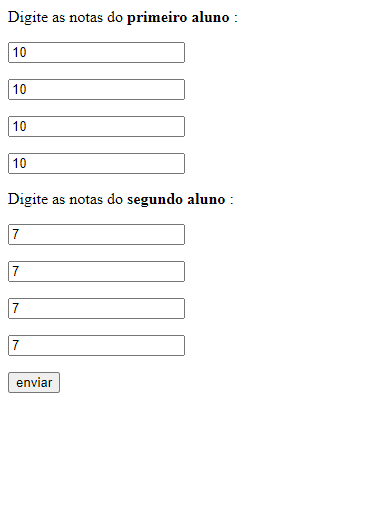

# CalculandoNotasMencoes
Esse repositório possui a resolução de um dos exercícios requisitados pelo meu professor de PHP da Etec da Zona Leste. Esse programa web recebe 4 notas de 2 alunos e depois as transforma em menções, que são as notas usadas na minha escola.

# Exibido na Web:

